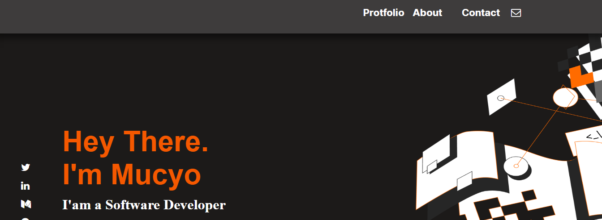

> Desktop version

> This project is my profile website responsive version and created in html css and javascript. it is still ongoing project.



Additional description about the project and its features.

## Built With

- CSS
- HTML
- Javascript

## Live Demo

[link to my profile](https://mucyosoda.github.io/setup-and-mobile-version-skeleton/)

## Getting Started

```
first clone my repository by using this link:https://github.com/Mucyosoda/setup-and-mobile-version-skeleton
cd Hello-Microverse
Open Vs code then click on Go Live then you will be able to see the code live
```

## Authors

👤 **Claude Mucyo **

## 🤝 Contributing

Contributions, issues, and feature requests are welcome!

## Show your support

Give a ⭐️ if you like this project!

## Acknowledgments

- Hat tip to anyone whose code was used
- Inspiration
- etc

## 📝 License

This project is [MIT](./MIT.md) licensed.
