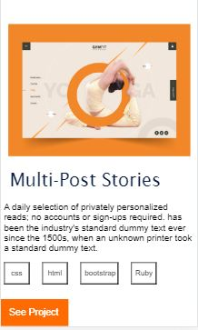

# Claude Mucyo Ntacyonungutse

> One paragraph statement about the project.



Additional description about the project and its features.

## Built With

- Major languages
- CSS
- HTML

## Live Demo

[Live Demo Link](https://livedemo.com)

## Getting Started

```
first clone my repository by using this link:https://github.com/Mucyosoda/setup-and-mobile-version-skeleton
cd setup-and-mobile-version-skeleton/mobileVersion
Open Vs code then click on Go Live then you will be able to see the code live
```

### Prerequisites

- Text editor
- Git
- Html
- Css

## Authors

👤 **Claude Mucyo **

- GitHub: [@githubhandle](https://github.com/Mucyosoda)

👤

## 🤝 Contributing

Contributions, issues, and feature requests are welcome!

Feel free to check the [issues page](../../issues/).

## Show your support

Give a ⭐️ if you like this project!

## Acknowledgments

- Hat tip to anyone whose code was used
- Inspiration
- etc

## 📝 License

This project is [MIT](./MIT.md) licensed.
